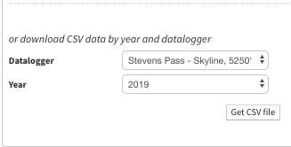
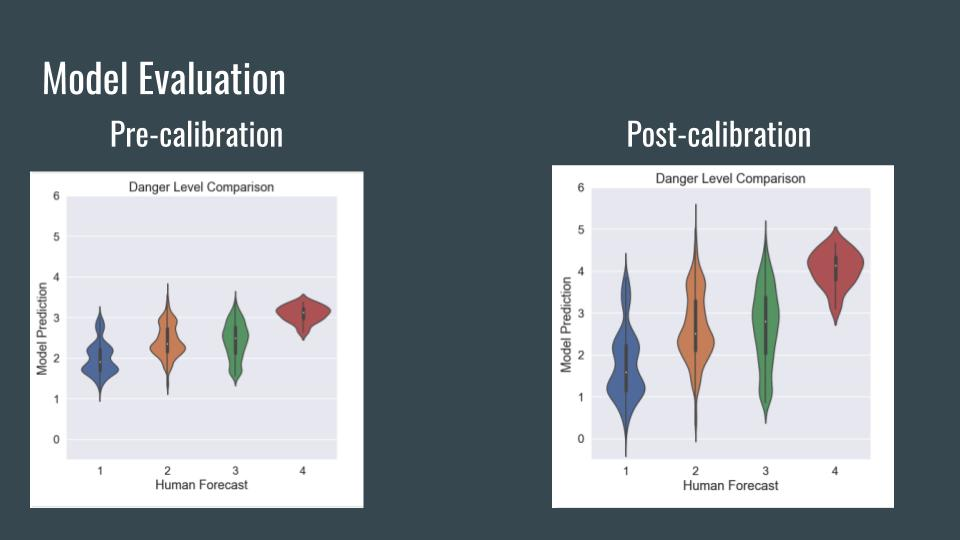

# Predicting Avalanche Danger

## Slide Deck:
https://docs.google.com/presentation/d/1YZgde4rLHyOBKZ2UWvqnlnnBDEOk82rECfeQudbjq30/edit?usp=sharing

## Business Understanding

As a backcountry skier in the Pacific Northwest, I rely on the avalanche forecast provided by nwac.us to help me determine my ski route and destination for a trip. Triggering an avalanche is something I would very much like to avoid. However, outside of the North America, avalanche danger level forecasts do not exist. My goal is to create a regression model to predict avalanche danger. 

## Data Understanding

Across the state, there exists a collection of weather stations that report every hour on the hour. This is super useful for weather forecasters to measure what is happening in areas not easily accessed.
The data collected from the weather stations is handily provided through nwac.us data portal in the form of csv files, going back since 2012. Below are links to the various files necessary: 

[Precipitation Data](https://www.nwac.us/data-portal/location/stevens-pass/q?field_name=precipitation&year=2019&custom_startdate=2014-01-01&custom_enddate=2019-06-28)

[Weather Data](https://www.nwac.us/data-portal/location/stevens-pass/)

Download every "Stevens Pass - Skyline, 5250'" csv file from 2014 to 2019

The archive of avalance danger forecasts only go back until 2014, and are given daily for three elevation bands: below treeline, near treeline, and above treeline. I decide to focus only on one elevation band, near-treeline since it is the elevation band 

[Precipitation Data](https://www.nwac.us/data-portal/location/stevens-pass/q?field_name=precipitation&year=2019&custom_startdate=2014-01-01&custom_enddate=2019-06-28)

Within their data portal, they do not provide an archive of their predicted danger forecasts. This problem is easily solved by scraping their archived forecasts. To solve this, three scrapes are necessary: the first is to first collect a list of urls that point to the numerous dates of human forecasts. Second, a scrape of the urls of each area's forecast for that particular date. And thirdly, the last scrape to obtain each page's html code. The html is saved into a MongoDB collection, which is then parsed through with Beautiful Soup to obtain the desired information of avalanche danger forecasts. This process can be performed in the jupyter notebook titled 'scrape_collect.' 

## Data Preparation

To merge the weather data to the avalanche forecats, abstracting the a date stamp separate from the hourly time reading is required. Since The avalanche forecasts are only daily forecasts, I am making an assumption that the whole 24 hour period will be designated this avalanche forecast. This is done so that I do not lose the granularity of the hourly data. Scattered throughout the weather station data, there are many instances of unrealistic measurements (ex. a negative 24 inchew of snow over the last 24 hours) so assumptions are made to clean up the data. Lastly, lag features are created to give the model more features. Avalanche problems/causes can last up to weeks, but to keep the model simple, I have chosen to implement lag features that only go back a few days. 

## Modeling

Rather than treating the output of my prediction model as a classification on a 0-5 discrete scale, I chose to treat the problem as a regression. By doing so, the comparison of my model's output will not match up with the human forecast. In order to validate my models performance, I implement violin plots to visualize the comparison between both the prediction and human forecast
After implementing scikit-learn's pipeline to test various regression algorithms, I ultimately chose the XGboost algorithm as it was the best performing on the basis of rmse vs predicting the mean. 

## Evaluation

Upon visualizing the model's prediction vs the human forecast, without calibration, the model's predictions are marginally lower than the human forecasts. After a calibration which rescales the outputs across +/- 2 standard deviations about the mean, the model performance improves. Overall, the model is able to identify high avalanche danger levels consistently. However, in determining the middle range of 2/3, the values are quite spread out. But at the end of the day, the true prediction is a **human** provided forecast, in where ambiguity of what true 2 or 3 varies between the various forecasters themselves. Who would have thought prediciting weather would be so hard?

## Deployment

The model is deployed as a Web Application that calculates the avalanche danger level prediction based on input values that correspond to a few days of weather data. 

[*Web Application*](http://www.avydangertool.online)

## Next Steps

My next steps in improving this project would be to first improve the model's performance. Weather data (what's in the sky) to supplement the weather station collection data would be great start, along with even more lag features. Secondly, I would also like to explore performing an ensemble of regression algorithms, random forest plus a linear regression, to ensure the model is able to pick up on once in a lifetime winter events, such as the 1963 recording of 78 inches in 24-hours at Thompson Pass, AK. 
